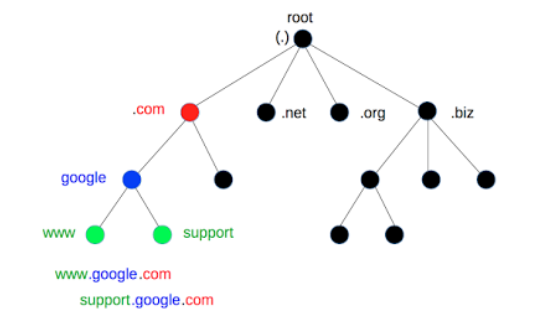

# DNS

## 0. DNS 서버란 ?

- **DNS(Domain Name System)**
  
  - Domain 주소 : 인터넷에 연결된 컴퓨터를 사람이 쉽게 기억하고 입력할 수 있도록 문자(영문, 한글 등)로 만든 인터넷주소
  - IP 주소 : 터넷 프로토콜 주소를 의미하며 숫자로 구성되어 인터넷에 연결된 장치를 식별
  - Domain Name System : 도메인 이름을 IP 주소로 변환해주는 시스템

## 1. DNS은 계층적 구조

> DNS는 상위기관, 하위 기관 처럼 "계층적 구조" 를 가짐 !
>
> > <u> **그게 무슨말이야 ?** </u>
>
> > - Domain 주소 세상에 엄청나게 많음 ! IP도 당연히 엄청나게 많음
> > - 한대의 서버를 가지고 모든 domain -> ip 변환 요청을 처리할 수 없음
> > - :baby: : _엥 그러면 서버를 여러개 두면 되잖아 ?_
> >   > - 계층을 두지 않고 단순히 서버를 여러대 만들어서 해결한다면,
> >   > - (도메인, 도메인에 해당하는 ip) 정보를 모든 서버가 다 저장해 두어야함
> > - 계층별로 쪼개서 분리해서 저장하는게 더 효율적 => 계층적 구조를 가지는 이유

## 2. 도메인의 구성요소

> 

- .(dot) 을 기준으로 계층이 나뉨

## 3. DNS 서버 구성 요소

### (1) Local DNS 서버

> URL에 Domain Name을 입력했을 때 해당 IP를 찾기위해 가장먼저 찾는 DNS서버
>
> - 보통 랜선으로 연결된 컴퓨터의 해당 통신사 서버로 연결됨 !

### (2) Root DNS 서버 (.)

> - 최상위 DNS서버
> - Local DNS 서버로 부터 요청을 받음
> - Root DNS Server의 목록에도 해당 Domain Name의 IP가 없을수 있음
>   > - 이럴때 자신에 등록되어 있는 최상위 도메인(TLD)에서 해당 도메인에 붙어있는 TLD 주소를 찾아서 돌려줌

### (3) TLD(최상위 도메인) DNS 서버 (ex. com)

> **Top-Level-Domain**
>
> - .org .com등의 일반 최상위 도메인 + .kr등의 국가 코드 최상위 도메인의 IP를 저장

### (4) 도메인 네임 서버 Authoritative DNS Server

> - 특정 도메인에 대한 DNS 정보를 보유하고 있는 서버

## 4. 작동 방식

### 1️⃣ host -> Local DNS server

- :baby: : Local DNS 서버야. byeoljali.com 의 ip 주소를 알려줘
- **case1** :computer:(Local DNS 서버) : 나 모르는데... Root DNS서버에 물어볼게
- **case2** :computer:(Local DNS 서버) : 해당 주소는 x.x.x.xxx야~ (끝) :check:

### 2️⃣,3️⃣ Local DNS <-> Root DNS server

- 2️⃣ :computer:(Local DNS 서버) : byeoljali.com의 ip주소가 뭐지?
- 3️⃣ :CD: Root DNS server : 난 모름. 대신 .com TLD 서버의 IP 주소를 줄게.

### 4️⃣,5️⃣ Local DNS <-> TLD DNS server

- 4️⃣ :computer:(Local DNS 서버) : byeoljali.com의 ip주소가 뭐지?
- 5️⃣ :king: TLD DNS server : 난 모름. 대신 byeoljali.com 도메인의 네임서버의 IP 주소를 줄게.

### 6️⃣,7️⃣ Local DNS <-> Authoritative DNS Server

- 6️⃣ :computer:(Local DNS 서버) : byeoljali.com의 ip주소가 뭐지?
- 7️⃣ 👀 TLD DNS server : 오 나 아는거다. byeoljali.com 도메인의 IP 주소는 x.x.xxx야 ~

## 5. :check: DNS cache

- 접속할 때마다 물어보려고 항상 위의 과정을 거치기에 굉장히 비효율적임
- PC내에 **DNS Cache** 로 이를 해결
  - 로컬 DNS서버는 요청을 받으면, 먼저 캐시를 확인해서 해당 도메인에 대한 ip를 가지는지 확인

> <u>Recursive query가 필요하지 않음 !</u>
>
> > - **Recursive query ?**
> >   - DNS 서버가 내부적으로 여러 단계를 거쳐 도메인 이름에 대한 IP 주소를 찾는 과정 (2️⃣ ~ 7️⃣)
