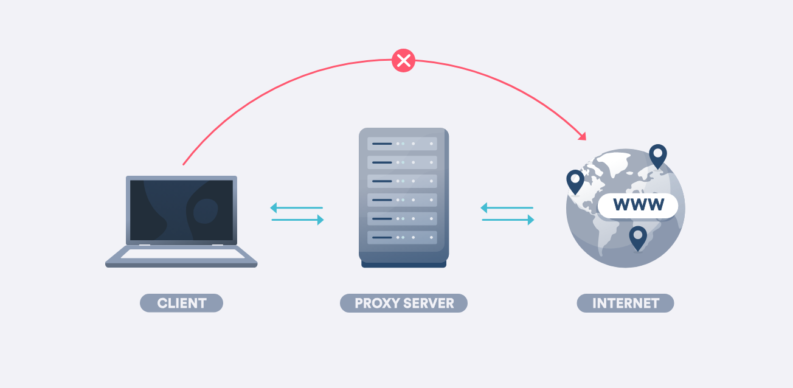
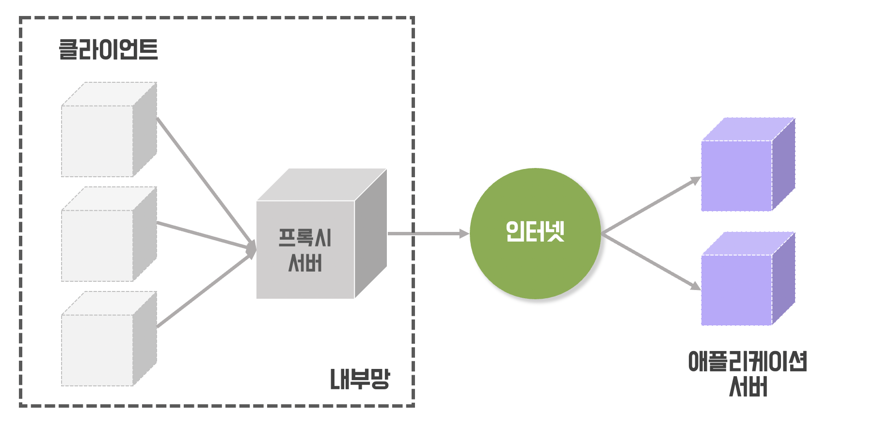
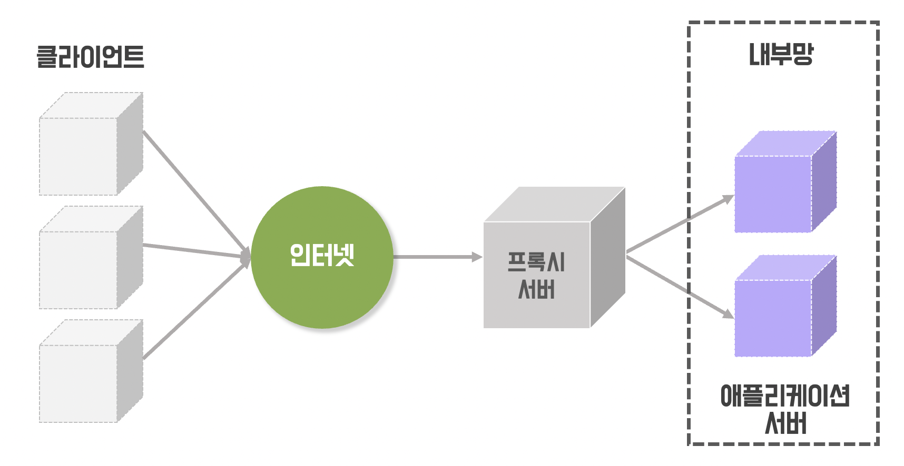

# Proxy

## 0. 프록시 서버의 개념

-   proxy : 대리인
-   proxy server : 장치와 인터넷 웹 사이트 간의 중개자

> -   프록시가 없으면 ?
>     > 트래픽이 장치에서 웹 사이트로 직접 흐름
> -   프록시가 있으면 ?
>     > 1. 요청한 웹 서버로 이동하기 전에 트래픽이 장치에서 프록시로 이동
>     > 2. 웹 사이트의 모든 응답은 프록시 서버로 돌아가서 사용자에게 전달

## 1. 프록시 서버 종류

-   예시 ) nignx, Apache

### 1) 정방향 프록시

##### 프록시, 포워드 프록시

#### 특징

-   캐싱 : 요청이 들어올 경우, 프록시 서버에 캐싱된 내용을 전달
    -   HTML, JS, CSS, 이미지와 같은 정적 파일들 캐싱
    -   프록시 서버가 물리적으로 더 가까운 위치에 있다면 전송 시간도 절약
-   IP 우회 : 서버 측에서는 요청을 받을 때 클라이언트의 IP가 아닌 프록시 서버의 IP를 전달
-   제한 : 정해진 사이트에만 연결 할 수 있도록 설정

### 2) 역방향 프록시

##### 리버스 프록시

#### 특징

-   로드밸런싱 : 리버스 프록시 뒤에 여러 개의 WAS를 둠으로써, 사용자 요청을 분산
    -   몇 서버가 장애가 발생했을 때 해당 서버로 요청을 보내지 않도록 설정
    -   무중단 배포 구현 가능 => 한 서버가 배포중일 때에는 프록시가 그 서버로 요청을 전달하지 않도록
-   보안 : 서버는 인터넷으로부터 숨겨지므로, 보안 상의 이유로 서버에 직접 접근하는 것을 막을 수 있음
-   캐싱 : 웹서버에 접근하기 전에 역방향 프록시에서 캐싱한 데이터를 돌려줌
-   ssl 암호화 : 애플리케이션 서버 대신 들어오는 요청을 암호화, 해독 해줌

---

### :star: 프록시 ?

-   직접 통신할 수 없는 두 점 사이에서 대리로 통신을 수행하는 기능을 프록시, 그 중계 기능을 하는것을 <U>프록시 서버</U>
-   네트워크에서 다른 서버로의 자원(파일, 연결, 웹 페이지 등) 요청을 중계/캐싱하며, 데이터 전송 시간, 외부 트래픽 감소, 네트워크 병목현상 방지, 보안 향상

### :star: 프록시 서버 위치

-   포워드 프록시 : 클라이언트 뒤
-   리버스 프록시 : 웹서버, WAS앞

### :star: 프록시 서버 통신 대상

-   포워드 프록시 : 프록시 서버 <-> 클라이언트
-   리버스 프록시 : 프록시 서버 <-> WAS

### :star: 감춰지는 대상

-   포워드 프록시 : 클라이언트를 숨겨줌
-   리버스 프록시 : WAS를 숨겨줌
