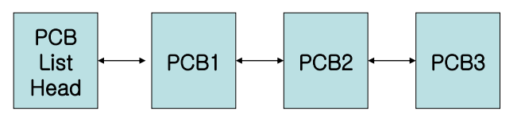
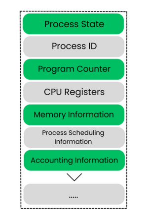
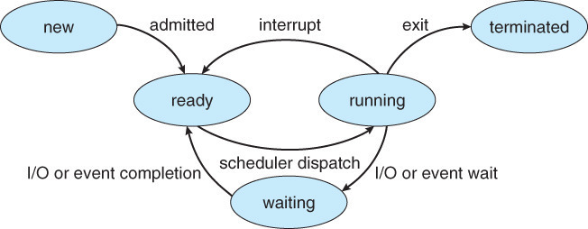
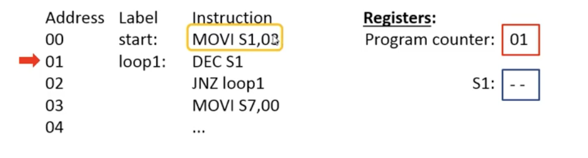

# PCB

## 0. 개념

- PCB (process control block) 프로세스 제어 블록
- 프로세스를 관리할 필요가 있는 **정보**가 저장된 운영체제 커널의 자료구조
- 각 프로세스 마다 고유한 PCB를 가짐

  - 프로세스가 생성될때마다 생기고, 프로세스가 완료되면 사라짐

- PCB들은 Linked List 방식으로 관리
  - 커널이 관리
  - 삽입, 삭제가 용이
  

  
  
 

## 1. 요소

 

- <U>Process Id</U> : 프로세스의 고유 번호
- <U>Process State</U> : ready, wait, running 등의 실행 상태  
    

    
    

- <U>Program Counter(PC)</U> : 프로그램 카운터, 다음 실행될 명령의 **포인터**
  

  
  

- <U>CPU registers</U> :  CPU 레지스터

  - CPU 레지스터내에서 프로그램 실행 동안 데이터를 임시 저장
  - PCB에서 해당 프로세스의 레지스터 내용을 저장해놓음

- <U>CPU scheduling information</U> : CPU 스케줄링 정보

- <U>Memory-management information</U> : 할당된 자원 정보
- <U>Accounting information</U> : CPU 사용시간 등
- <U>I/O status information</U> : 입출력 상태 정보
  - 프로세스에 할당된 입출력장치 목록

## 2. PCB의 역할

- process 실행 중이다가, 중단되어야 할때 (다른 process가 실행되어야 할때)
- 진행중이던 작업을 정리하고 CPU를 반환해야하는데 이때 CPU가 처리하던 정보를 해당 Process의 PCB를 저장함
