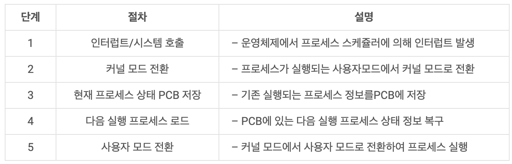
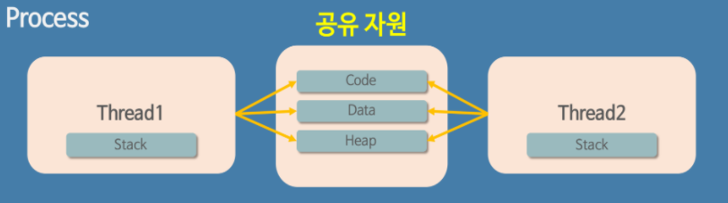

# context switching

- context : CPU가 해당 프로세스를 실행하기 위한 해당 프로세스의 정보
- 현재 진행중인 task의 상태를 저장하고 다음 task를 진행할 수 있도록 적용 하는 과정을 의미함 !
- context switching의 주체 => OS Scheduler

## 0. pre

- computer의 하나의 cpu는 하나의 일만 처리할 수 있음
- 우리 눈에는 여러가지 일을 동시에 처리하는 것 처럼 보임 ! 그 이유는?

  ```
  - cpu가 빠르게 task를 전환하여 실행하기 때문에!
  - 이 task를 어떤식으로 전환하냐는 다양한 전략이 존재
  ```

#### :rocket: context switching 이 일어나는 상황 - Interrupt

1. I/O request (입출력 요청할 때)
2. time slice expired (CPU 사용시간이 만료 되었을 때)
3. fork a child (자식 프로세스를 만들 때)
4. wait for an interrupt (인터럽트 처리를 기다릴 때)

## 1. process context Swtiching

- _하나의 CPU를 기준으로 설명함_
<p align="center">

</p>
<p align="center">

</p>

1. P1 -> P2로 전환 상태
2. P1 과 PCB1 이 있고, P2과 PCB2이 있음.
3. CPU는 P1를 진행할때 사용했던 값들을 PCB1에 저장함
4. P2의 PCB2를 메모리에서 가져와서, CPU에 업데이트함
5. CPU는 이전 중단된 시점부터 P2를 재 실행할 수 있게됨

## 2. thread context switching

<p align="center">

</p>
<p align="center">

</p>

- 쓰레드(thread)는 프로세스가 PCB를 가지는 것 처럼, TCB(thread control block) 을 가짐 !

  - 스택(Stack)을 제외한 코드(Code), 데이터(Data), 힙(Heap) 영역은 프로세스의 것

  - TCB 에는 스택 및 간단한 정보만 저장
    <br>

```
 공유하는 자원은 바꿔줄 필요 없음! 스택 등의 간단한 정보만 바꿔주면 되므로, 프로세스 콘텍스트 스위칭보다 빠르다.
```

## 3. context Switching overhead

- <U>overhead 오버헤드</U> : 어떤 일을 처리하는데 들어가는 추가적인 시간
  - A라는 처리를 단순하게 실행한다면 10초 걸리는데, 안전성을 고려하고 부가적인 B라는 처리를 추가한 결과 처리시간이 15초 걸렸다면, <U>오버헤드는 5초</U>
  - context switching이 일어나는 동안 CPU는 작업을 처리하지 못함
- context switching이 잦아지면 오버헤드가 발생해서 효율이 떨어짐

### :rocket: context switching overhead 해결 방안

1. 프로그램 다중화 수준 낮추기 (빈도 감소)
2. 스레드를 이용하기 (context switching 에서 부하 최소화)
