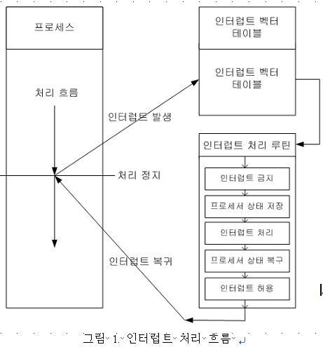

# Interrupt

## 0. 개념

- CPU가 프로그램을 실행하고 있을 때, 입출력 하드웨어 등의 장치에 _예외상황_ 이 발생해 CPU에게 알려 처리할 수 있도록 하는 것
- 하드웨어 Interrupt, 소프트웨어 Interrupt로 나눈다.
- Interrupt는 고유한 벡터 값을 가진다

## 1. 🤖 Hardware Interrupt

- 일반적인 Interrupt를 말할 땐 Hardware Interrupt를 말함
- Asynchronous interrupt (비동기적)
- CPU 외부에서 발생

### 1-1 Maskable interrupt

- Mask (인터럽트 발생시 처리할지 말지 결정하는 것)가 가능
- 입출력 장치 인터럽트 (I/O)등 대부분이 해당

### 1-2 Non Maskable interrupt

- Mask 불가능
- 정전, 하드웨어 고장 등 불가피한 이유

## 2. 💿 Software Interrupt

- Synchronous interrupt (동기적) = trap
- CPU 내부에서 발생

### 2-1. System call Interrupt

- 특정 프로그램이 OS 단의 kernel 기능을 활용할 때 사용
- 사용자 프로그램이 커널 모드로 전환

### 2-2. exception Interrupt

- 에러
- ex ) zero exceptiion (0나누기)

### 2-3. timer Interrupt

- OS가 타이머를 사용하여 정기적으로 발생
- 프로세스 스케줄링에 맞춰 발생
- 일정 시간 슬라이스가 경과하면 현재 실행 중인 프로세스를 중단하고 다음 프로세스를 실행

## 3. 🔪 Interrupt Handling

- ISR (Interrupt Service Routine)

  - 인터럽트가 발생했을 때 실행되는 특별한 코드 블록 또는 함수
  - OS나 특정 하드웨어에서 정의해놓음 !
  - 운영체제마다 설계, 정책이 다르다.
  - 인터럽트의 벡터값을 가지고, 인터럽트 백터 테이블에서 맞는 ISR의 위치를 찾을 수 있음.
  

  

- 과정
  1. 현재 상태 저장하기 (PC, 상태값 등)
  2. ISR 호출 (미리 정의해놓고 사용)
  - 각 인터럽트 마다 ISR 존재함
  1. ISR 실행
  2. 실행이 끝나면 이전 실행 상태로 복원

 
