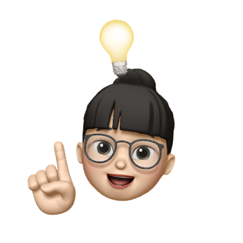

# :gift_heart: CS Study

취뽀를 위한 CS study 
CS 스터디 시작(2024.02.19~) 
매주 월요일 20:30  
매주 토요일에 모르는 문제 issue 작성

## :memo: Contents
- [운영체제](https://github.com/AucSuSu/CS-study/tree/main/OS)
- [네트워크](https://github.com/AucSuSu/CS-study/tree/main/Network)
- [데이터베이스](https://github.com/AucSuSu/CS-study/tree/main/Database)
- [자료구조 & 알고리즘](https://github.com/AucSuSu/CS-study/tree/main/Algorithm)
- [디자인 패턴](https://github.com/AucSuSu/CS-study/tree/main/DesignPattern)
- [자바](https://github.com/AucSuSu/CS-study/tree/main/Language/JAVA)
- [스프링](https://github.com/AucSuSu/CS-study/tree/main/SPRING) 

## 🌳 일정 
|날짜|content|문수|태우|아림|라엘|우미|태호|
|------|--------|---|---|---|---|---|------|
|2023.02.26|운영체제|캐시의 지역성|CPU 스케줄링 / 스케줄러|Context switching|메모리 단편화 / 가상 메모리 / 메모리 관리 전략|세마포어/뮤텍스|멀티스레드/데드락|
|2023.03.04|운영체제|요구페이징|동기/비동기 차이|PCB / Interrupt|프로세스 동기화|프로세스/스레드|멀티스레드/데드락|
|2023.03.11|DB|트랜잭션(ACID)|RDBMS, NoSQL|정규화|테이블 설계|인덱스|트랜잭션 격리수준|
|2023.03.18|네트워크|CORS|세션&쿠키|DNS|JWT|http vs https|GET POST|
|2023.03.25|네트워크|게이트웨이|TCP UDP|프록시|OSI 7계층|RESTful API|3-way-handshaking|

## :family: 팀원 소개
<table>
  <tbody>
    <tr>
      <td align="center"><a href="https://github.com/MunsooKang"> <b>강문수</b></a> </td>
      <td align="center"><a href="https://github.com/arim-kim"> <b>김아림</b></a> </td>
      <td align="center"><a href="https://github.com/makie082"> <b>우미경</b></a> </td>
      <td align="center"><a href="https://github.com/dogfish000"> <b>윤태우</b></a> </td>
      <td align="center"><a href="https://github.com/ttaho"> <b>윤태호</b></a> </td>
      <td align="center"><a href="https://github.com/RaelJung"> <b>정라엘</b></a> </td>
    </tr>
  </tbody>
</table>

## :bulb: Reference
- [https://appleg1226.tistory.com/37](https://appleg1226.tistory.com/37) 
- [https://github.com/WeareSoft/tech-interview](https://github.com/WeareSoft/tech-interview) 
- [https://github.com/JaeYeopHan/Interview_Question_for_Beginner](https://github.com/JaeYeopHan/Interview_Question_for_Beginner) 
- [https://github.com/Seogeurim/CS-study?tab=readme-ov-file](https://github.com/Seogeurim/CS-study?tab=readme-ov-file) 

